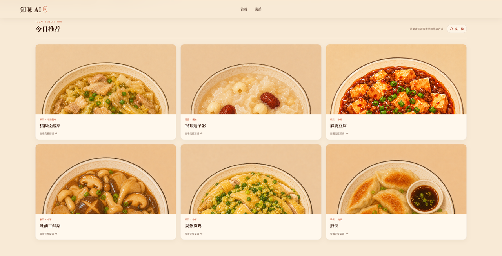
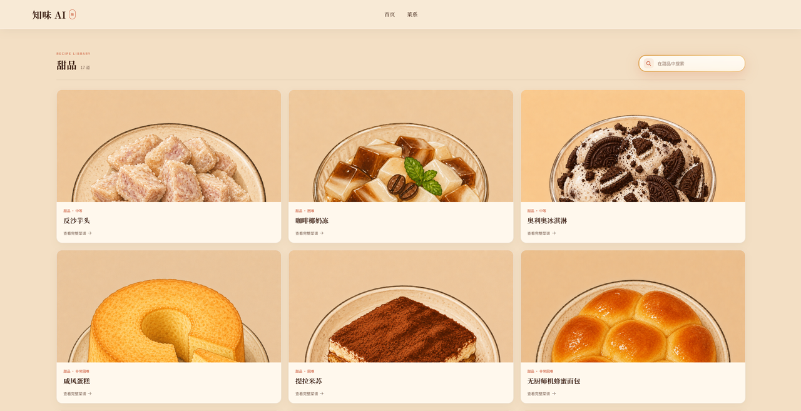

# 知味食谱——智能菜谱推荐助手

知味 AI 是一个基于本地菜谱知识库的智能美食推荐应用。它支持菜谱浏览、关键词搜索、自然语言推荐和流式 AI 问答，可以根据菜名、口味、菜品类型或食材帮助用户找到合适的菜谱。


## ✨ 功能特点

- **智能推荐**：用自然语言描述需求，例如“推荐几道清淡的菜”或“我想吃鸡蛋”
- **菜谱搜索**：支持精确菜名、模糊菜名、食材和口味搜索
- **分类浏览**：覆盖荤菜、素菜、汤品、甜品、早餐、主食、水产、调料和饮品
- **详细步骤**：展示原料、用量、烹饪步骤、难度和实用提示
- **流式回答**：AI 内容逐步返回，减少长回答的等待时间
- **混合检索**：结合 FAISS 向量检索、BM25 和元数据过滤
- **响应式界面**：支持桌面端和移动端访问

## 🖼️ 界面预览

### 今日推荐

首页会从菜谱知识库中展示推荐菜品，用户可以换一组结果或直接进入菜谱详情。



### 分类菜谱

菜系页面支持按分类浏览和搜索菜谱，并展示菜品图片、难度和详情入口。



## 📚 数据概况

- 322 个 Markdown 菜谱
- 322 张 WebP 菜品图片（800 × 800）
- 10 个实际菜谱分类
- 预构建 FAISS 向量索引
- 中文嵌入模型：`BAAI/bge-small-zh-v1.5`
- 对话模型：通过环境变量接入 OpenAI 兼容服务，示例配置使用 `deepseek-v4-flash`

## 🛠️ 技术栈

### 前端

- React 19
- Vite 6
- Phosphor Icons
- 原生 CSS 响应式布局

### 后端

- Python 3.11
- FastAPI
- Uvicorn
- LangChain
- OpenAI 兼容模型 API

### RAG

- FAISS 向量检索
- BM25 关键词检索
- RRF 混合排序
- Markdown 结构化分块
- 菜名、食材、口味和菜品类型元数据过滤

## 🧱 运行架构

```text
浏览器
   │
   ▼
React + Vite（127.0.0.1:5173）
   │
   ├── /api/* ───────────────┐
   └── /recipe-images/* ─────┤
                              ▼
                    FastAPI（127.0.0.1:8000）
                              │
              ┌───────────────┼───────────────┐
              ▼               ▼               ▼
        Markdown 菜谱      FAISS / BM25     DeepSeek API
```

开发环境中，Vite 会把 `/api` 和 `/recipe-images` 请求转发到 FastAPI。

## 📁 项目结构

```text
.
├── Rag/
│   ├── api.py                    # FastAPI 接口
│   ├── main.py                   # RecipeRAGSystem 主流程
│   ├── config.py                 # 模型、数据和检索配置
│   ├── rag_modules/
│   │   ├── data_preparation.py   # 菜谱加载与分块
│   │   ├── index_construction.py # FAISS 索引
│   │   ├── retrieval_optimization.py
│   │   ├── generation_integration.py
│   │   └── recipe_metadata.py
│   ├── vector_index/             # 已生成的 FAISS 索引
│   ├── requirements.txt
│   ├── test_api.py
│   └── test_query_logic.py
├── zhiwei-web/
│   ├── src/                      # React 页面与样式
│   ├── package.json
│   └── vite.config.mjs
├── data/
│   ├── dishes/                   # 按分类存放的 Markdown 菜谱
│   └── 图片/                     # 网页使用的菜品 WebP
├── .env.example
└── README.md
```

## 🚀 获取源码后开始运行

以下操作都在项目根目录执行。后端和前端需要分别占用一个终端窗口。

### 1. 从 GitHub 克隆项目

请先确认电脑已安装 Git：

```powershell
git --version
```

在准备存放项目的目录中执行：

```powershell
git clone https://github.com/Initial512/zhiwei-recipe-rag.git
cd zhiwei-recipe-rag
```

执行后续命令前，请确认终端当前位于 `zhiwei-recipe-rag` 项目根目录。

### 2. 检查源码是否完整

源码中必须包含：

```text
data/dishes
data/图片
Rag/vector_index
```

Windows PowerShell：

```powershell
(Get-ChildItem data\dishes -Recurse -Filter *.md -File).Count
(Get-ChildItem data\图片 -Filter *.webp -File).Count
```

两个结果正常情况下都应为 `322`。如果目录不存在或数量为 `0`，说明拿到的源码缺少菜谱数据，后端无法启动。

### 3. 安装运行环境

请先安装：

- Python 3.11
- Node.js 20 或更高版本
- npm

确认环境：

```powershell
python --version
node --version
npm --version
```

### 4. 创建 Python 虚拟环境

Windows PowerShell：

```powershell
python -m venv .venv
.\.venv\Scripts\Activate.ps1
python -m pip install --upgrade pip
python -m pip install -r .\Rag\requirements.txt
```

如果 PowerShell 阻止激活脚本，可以不激活虚拟环境，后续直接使用：

```powershell
.\.venv\Scripts\python.exe
```

macOS / Linux：

```bash
python3.11 -m venv .venv
source .venv/bin/activate
python -m pip install --upgrade pip
python -m pip install -r Rag/requirements.txt
```

### 5. 配置模型服务

Windows PowerShell：

```powershell
Copy-Item .env.example Rag\.env
```

macOS / Linux：

```bash
cp .env.example Rag/.env
```

编辑 `Rag/.env`，配置模型服务地址、模型名称和 API Key。

默认的 DeepSeek 配置：

```dotenv
LLM_BASE_URL=https://api.deepseek.com
LLM_MODEL=deepseek-v4-flash
LLM_API_KEY=your_real_api_key
```

如果使用其他兼容 OpenAI API 格式的服务，只需要替换这三项：

```dotenv
LLM_BASE_URL=your_openai_compatible_base_url
LLM_MODEL=your_model_name
LLM_API_KEY=your_api_key
```

| 环境变量 | 说明 |
| --- | --- |
| `LLM_BASE_URL` | 模型服务的 OpenAI 兼容接口地址 |
| `LLM_MODEL` | 服务商支持的模型名称 |
| `LLM_API_KEY` | 对应服务商签发的 API Key |

三项都必须填写。不要把真实密钥提交到 Git，项目已经通过 `.gitignore` 忽略 `Rag/.env`。

### 6. 启动后端

打开第一个终端。

Windows PowerShell：

```powershell
cd Rag
..\.venv\Scripts\python.exe -m uvicorn api:app --host 127.0.0.1 --port 8000
```

macOS / Linux：

```bash
cd Rag
../.venv/bin/python -m uvicorn api:app --host 127.0.0.1 --port 8000
```

启动成功后可以访问：

- 健康检查：<http://127.0.0.1:8000/api/health>
- API 文档：<http://127.0.0.1:8000/docs>

首次启动需要加载 `BAAI/bge-small-zh-v1.5`。如果本机没有模型缓存，程序会从 Hugging Face 下载，所需时间取决于网络速度。

### 7. 启动前端

保持后端运行，再打开第二个终端：

```powershell
cd zhiwei-web
npm ci
npm run dev
```

浏览器访问：

<http://127.0.0.1:5173>

## 🍳 使用示例

可以在搜索框或 AI 对话区域输入：

```text
宫保鸡丁怎么做
推荐几道辣菜
我想喝汤
鸡蛋可以做什么
推荐适合早餐的菜
```

系统会先判断查询意图，再执行菜谱查找、条件推荐或普通助手回答。

## 🔌 主要接口

| 方法 | 路径 | 用途 |
| --- | --- | --- |
| `GET` | `/api/health` | 后端健康检查 |
| `GET` | `/api/categories` | 获取菜谱分类 |
| `GET` | `/api/recipes` | 获取菜谱列表 |
| `GET` | `/api/search` | 搜索菜谱 |
| `GET` | `/api/recipes/{dish_name}` | 获取菜谱详情 |
| `GET` | `/api/recommendations` | 获取推荐结果 |
| `POST` | `/api/query/classify` | 判断查询类型 |
| `POST` | `/api/chat/stream` | 流式菜谱问答 |
| `POST` | `/api/assistant/stream` | 流式通用回答 |

完整请求参数和响应结构以 <http://127.0.0.1:8000/docs> 为准。

## 🧪 测试

后端测试需要额外安装 `pytest`：

```powershell
.\.venv\Scripts\python.exe -m pip install pytest
cd Rag
..\.venv\Scripts\python.exe -m pytest -q
```

前端检查：

```powershell
cd zhiwei-web
npm ci
npm run build
```

当前测试覆盖：

- 菜谱元数据解析
- 查询意图识别
- 推荐结果过滤
- SSE 流式数据格式
- 中文图片 URL
- 静态图片响应
- 菜谱与网页图片完整映射

## ☁️ 免费部署

推荐架构：

```text
Vercel（React 静态前端）
        │
        ▼
Hugging Face Docker Space（FastAPI + BGE + FAISS + 菜谱数据）
        │
        ▼
DeepSeek API
```

当前应用不保存用户数据，因此不需要部署数据库或 Supabase。FAISS 索引已经位于
`Rag/vector_index`，Docker 镜像构建时会同时包含索引、Markdown 菜谱和菜品图片。

### 1. 部署后端到 Hugging Face Spaces

1. 在 Hugging Face 创建一个新的 **Docker Space**，免费硬件选择 `CPU Basic`。
2. 将本仓库推送到 Space 仓库。根目录的 `Dockerfile` 会自动构建 FastAPI 服务。
3. 在 Space 的 **Settings → Variables and secrets** 中添加以下 Secrets：

```dotenv
LLM_BASE_URL=https://api.deepseek.com
LLM_MODEL=deepseek-v4-flash
LLM_API_KEY=your_real_api_key
```

4. 添加以下 Variable；首次部署前可以先填写临时值，Vercel 部署完成后再替换为真实域名：

```dotenv
CORS_ORIGINS=https://your-project.vercel.app
```

Space 构建完成后，后端地址格式如下：

```text
https://<account>-<space-name>.hf.space
```

健康检查：

```text
https://<account>-<space-name>.hf.space/api/health
```

不要把真实 `LLM_API_KEY` 写入 `.env.example`、Dockerfile 或提交到 Git。

### 2. 部署前端到 Vercel

1. 在 Vercel 导入同一个 GitHub 仓库。
2. 将 **Root Directory** 设置为 `zhiwei-web`。
3. 使用以下构建配置：

```text
Framework Preset: Vite
Build Command: npm run build
Output Directory: dist
```

4. 添加 Production 环境变量：

```dotenv
VITE_API_BASE_URL=https://<account>-<space-name>.hf.space
```

5. 触发一次重新部署。`zhiwei-web/vercel.json` 已配置 SPA 回退，因此直接访问或刷新
`/recipe/...`、`/category/...`、`/search` 和 `/answer` 不会返回 404。

### 3. 完成跨域配置

取得 Vercel 正式域名后，回到 Hugging Face Space，将 `CORS_ORIGINS` 更新为该域名。
如需同时允许多个域名，使用英文逗号分隔：

```dotenv
CORS_ORIGINS=https://your-project.vercel.app,https://www.your-domain.com
```

更新变量会重启 Space。重启完成后依次验证：

- `/api/health` 返回 `status: ok` 和 `ready: true`
- 首页分类和推荐正常加载
- 搜索、菜谱详情和图片正常
- AI 流式回答可以完整结束
- 直接刷新前端子路径不会出现 404

## 📝 修改菜谱

每个分类目录中的 Markdown 文件代表一道菜：

```text
data/dishes/<分类>/<菜名>.md
```

网页图片使用独立目录：

```text
data/图片/<菜名>.webp
```

Markdown 文件名和 WebP 文件名应保持一致，否则网页无法找到对应菜品图片。

修改、添加或删除菜谱后，需要重建 FAISS 索引：

```powershell
Remove-Item Rag\vector_index\index.faiss
Remove-Item Rag\vector_index\index.pkl
```

再次启动后端，程序会读取全部 Markdown 并自动生成新索引。重建期间不要关闭终端。

## ❓ 常见问题

### 后端提示缺少模型环境变量

确认文件位置是：

```text
Rag/.env
```

并确认其中同时存在有效的：

```dotenv
LLM_BASE_URL=...
LLM_MODEL=...
LLM_API_KEY=...
```

本项目通过 `ChatOpenAI` 调用模型，因此所选服务必须提供 OpenAI 兼容接口。

### PowerShell 无法激活虚拟环境

无需修改系统执行策略，可以直接调用虚拟环境中的 Python：

```powershell
.\.venv\Scripts\python.exe
```

### 首次启动时间较长

首次运行可能需要下载嵌入模型。请确认能够访问 Hugging Face，并等待模型下载和加载完成。

### 前端打开后没有数据

先确认后端健康检查可访问：

<http://127.0.0.1:8000/api/health>

再检查前端终端和后端终端是否存在报错。前端开发服务器默认把接口转发到 `http://127.0.0.1:8000`。

### 端口被占用

查看占用 8000 端口的进程：

```powershell
Get-NetTCPConnection -LocalPort 8000
```

查看占用 5173 端口的进程：

```powershell
Get-NetTCPConnection -LocalPort 5173
```

结束冲突进程，或修改 Uvicorn 端口及 `zhiwei-web/vite.config.mjs` 中的代理目标。

### FAISS 索引加载失败

删除 `Rag/vector_index/index.faiss` 和 `Rag/vector_index/index.pkl`，然后重新启动后端。程序会自动重建索引。

## 🙏 数据说明

菜谱内容整理自开源菜谱资料，保留 Markdown 结构以便进行分块、检索和生成。使用或再分发数据前，请同时确认原始菜谱数据对应的许可要求。
