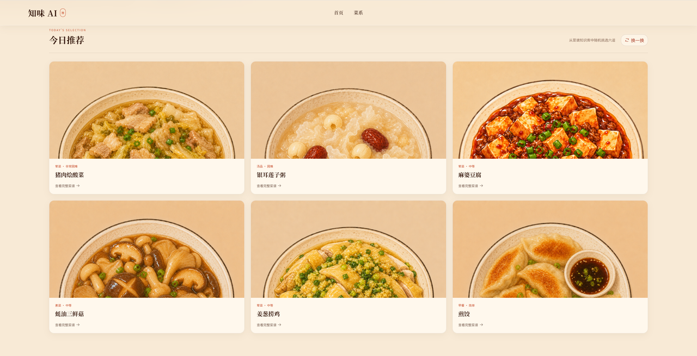
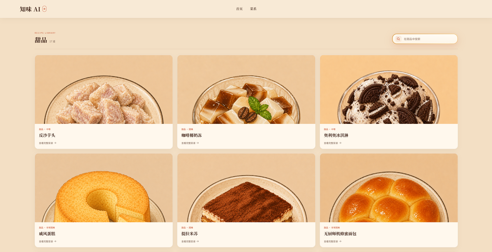

# 知味食谱——智能菜谱推荐助手

知味 AI 是面向中文菜谱的检索与烹饪助手。它将本地菜谱、Neo4j 知识图谱、Milvus 向量检索与 OpenAI 兼容模型结合，为找菜、做菜和菜谱关系查询提供流式回答。

## ✅ 功能特点

- **分类浏览与菜名搜索**：浏览 10 个菜谱分类；本地菜名匹配不调用大模型，可直接进入详情页。
- **菜谱推荐**：根据食材、口味、用餐场景和菜品类型检索候选菜谱。
- **完整详情**：展示成品图、难度、简介、食材分组、制作步骤、提示、时间和份量信息。
- **智能查询路由**：简单菜谱问题走混合检索；明确的关系与多跳问题可进入 GraphRAG。
- **饮食助手**：身份和无关问题不访问知识库，由知味 AI 饮食推荐小助手直接回答或引导回烹饪话题。
- **流式回答**：通过 SSE 逐段返回模型内容；菜谱回答可附带相关菜谱来源卡片。

## 🖼️ 界面预览

### 今日推荐

首页从当前菜谱库随机展示六道菜，可换一组或直接查看详情。

### 分类菜谱

分类页支持按菜名过滤，并展示菜品图片、难度与详情入口。

## 📊 数据与技术栈

- 322 份 Markdown 菜谱源文件、对应 WebP 图片和 10 个展示分类。
- Neo4j 5 存储菜谱、食材、分类和步骤关系；图谱导入资产位于 `data/graph/cypher/`。
- Milvus 2 构建菜谱文本向量索引；默认嵌入模型为 `BAAI/bge-small-zh-v1.5`。
- 后端使用 Python 3.11、FastAPI、LangChain 和 OpenAI 兼容模型 API。
- 前端使用 React 19、Vite 6、Phosphor Icons、原生 CSS 与 Nginx。

## 🧭 运行架构与查询路由

~~~mermaid
flowchart TD
    browser["浏览器"] --> frontend["React + Nginx localhost:80"]
    frontend -->|"/api/*"| backend["FastAPI localhost:7860"]
    frontend -->|"/recipe-images/*"| backend
    backend --> neo4jStore["Neo4j 菜谱知识图谱"]
    backend --> milvusStore["Milvus 语义向量检索"]
    backend --> llmService["OpenAI 兼容 LLM"]
    neo4jStore --> graphAssets["图谱导入资产 data/graph/cypher"]
~~~

Docker Compose 负责 Neo4j、Milvus、FastAPI 和 Nginx 的生命周期。Neo4j 数据为空时会导入图谱；Milvus collection 缺失或文档数量变化时会重建向量索引。

网页提交问题后，先调用 `/api/query/classify`。菜谱和推荐问题进入 `/api/chat/stream`；身份、能力和无关问题进入 `/api/assistant/stream`。后端会再次守卫该分流，避免直接调用接口时误触发检索。

`IntelligentQueryRouter` 在混合检索与 GraphRAG 间选择策略。多跳关系查询会使用有界图路径：最多三跳、最多五个起点、最多二十条路径；Neo4j 查询默认超时为 5 秒，可通过 `NEO4J_QUERY_TIMEOUT_SECONDS` 覆盖。

## 📁 项目结构

~~~text
.
├── Rag/
│   ├── api.py                         # FastAPI 路由、SSE、菜谱目录与详情解析
│   ├── main.py                        # RecipeRAGSystem 生命周期与模块编排
│   ├── config.py                      # 运行配置与 Neo4j 查询超时
│   ├── recipe_metadata.py             # 菜名与推荐意图解析
│   ├── requirements.txt               # 后端依赖
│   ├── test_graph_query_planning.py   # GraphRAG 规划与路径测试
│   ├── test_hybrid_retrieval.py       # 混合检索测试
│   ├── test_llm_configuration.py      # 模型配置与流式生成测试
│   ├── test_replacement_rag.py        # API、目录和生命周期测试
│   ├── test_structured_output.py      # 结构化模型输出测试
│   └── rag_modules/
│       ├── generation_integration.py  # 系统提示词与 OpenAI 兼容生成
│       ├── graph_data_preparation.py  # 从 Neo4j 加载并构建菜谱文档
│       ├── graph_indexing.py          # 图谱键值索引
│       ├── graph_rag_retrieval.py     # 有界 GraphRAG 检索
│       ├── hybrid_retrieval.py        # BM25、图谱与向量混合检索
│       ├── intelligent_query_router.py# 查询策略选择
│       ├── milvus_index_construction.py # Milvus collection 与向量索引
│       └── structured_output.py       # 模型 JSON 输出解析
├── zhiwei-web/
│   ├── src/                           # React 页面、样式与格式化工具
│   ├── nginx.conf                     # 生产反向代理与静态托管
│   └── package.json                   # 前端脚本与依赖
├── data/
│   ├── dishes/                        # 原始 Markdown 菜谱
│   ├── 图片/                           # 菜品 WebP 图片
│   └── graph/cypher/                  # Neo4j CSV 与导入脚本
├── docker-compose.yml                 # 全部服务编排
├── Dockerfile                         # 后端镜像
└── .github/workflows/ci.yml           # 密钥扫描、质量检查与构建
~~~

## 🚀 快速开始

以下 Docker 命令均在项目根目录执行。推荐使用 Docker Desktop；本地运行测试或前端开发还需要 Python 3.11、Node.js 20+ 与 npm。

### 1. 获取代码

~~~powershell
git clone https://github.com/Initial512/zhiwei-recipe-rag.git
cd zhiwei-recipe-rag

docker --version
docker compose version
~~~

### 2. 配置环境变量

在 `Rag/.env` 创建或填写以下变量。不要将真实密钥提交到仓库。

~~~dotenv
LLM_BASE_URL=https://your-openai-compatible-endpoint
LLM_MODEL=your-model-name
LLM_API_KEY=your-api-key
NEO4J_PASSWORD=replace-with-a-strong-password
MINIO_ACCESS_KEY=replace-with-a-minio-username
MINIO_SECRET_KEY=replace-with-a-minio-password

# 可选：GraphRAG 单次 Neo4j 查询超时，单位为秒；默认 5
NEO4J_QUERY_TIMEOUT_SECONDS=5
~~~

| 变量 | 说明 |
| --- | --- |
| `LLM_BASE_URL` | OpenAI 兼容模型服务地址 |
| `LLM_MODEL` | 可用模型名称 |
| `LLM_API_KEY` | 模型服务密钥 |
| `NEO4J_PASSWORD` | Neo4j 密码 |
| `MINIO_ACCESS_KEY` / `MINIO_SECRET_KEY` | Milvus 依赖的 MinIO 凭证 |
| `NEO4J_QUERY_TIMEOUT_SECONDS` | GraphRAG 的 Neo4j 查询超时，默认 5 秒 |

`LLM_BASE_URL`、`LLM_MODEL`、`LLM_API_KEY` 缺少任一项时，后端不会启动。

### 3. 启动与健康检查

~~~powershell
docker compose --env-file Rag/.env up --build --detach
docker compose --env-file Rag/.env ps
~~~

服务就绪后访问：

- 应用首页：[http://localhost](http://localhost)
- 健康检查：[http://localhost:7860/api/health](http://localhost:7860/api/health)
- OpenAPI 文档：[http://localhost:7860/docs](http://localhost:7860/docs)

健康检查返回 `{"status":"ok","ready":true}` 时，检索与生成模块已初始化。首次启动可能需要等待嵌入模型加载、图谱导入和 Milvus 索引创建。

### 4. 重启、日志与本地前端开发

~~~powershell
# 重启网页与后端
docker compose --env-file Rag/.env restart backend frontend

# 查看后端日志
docker compose --env-file Rag/.env logs -f backend
~~~

本地开发前端时，先启动 Docker 后端：

~~~powershell
Push-Location zhiwei-web
npm ci
$env:VITE_API_TARGET = "http://127.0.0.1:7860"
npm run dev
Pop-Location
~~~

打开 [http://127.0.0.1:5173](http://127.0.0.1:5173)。生产前端通过同源 `/api` 请求后端，无需设置该变量。

## 💡 使用示例

~~~text
宫保鸡丁怎么做？
推荐几道辣菜
鸡蛋可以做什么？
鸡肉通过哪些菜谱与哪些蔬菜相连？请说明多跳关系。
你是谁？
~~~

前四类烹饪问题会使用本地菜谱、混合检索或 GraphRAG；“你是谁？”等身份问题由饮食助手直接回答，不检索知识库。

## 🔌 主要接口

| 方法 | 路径 | 用途 |
| --- | --- | --- |
| GET | `/api/health` | 后端健康检查 |
| GET | `/api/categories` | 获取分类及菜谱数量 |
| GET | `/api/recipes` | 按分类获取菜谱，支持 `query` |
| GET | `/api/search` | 结构化菜谱检索或条件推荐，供外部调用 |
| GET | `/api/search/recipes` | 本地菜名匹配，不调用 LLM |
| GET | `/api/recipes/{dish_name}` | 获取完整菜谱详情 |
| GET | `/api/recommendations` | 获取随机推荐 |
| POST | `/api/query/classify` | 将问题识别为 `recipe` 或 `assistant` |
| POST | `/api/chat/stream` | 流式菜谱问答；服务端会拒绝将闲聊送入检索 |
| POST | `/api/assistant/stream` | 流式饮食助手回答，不检索知识库 |
| POST | `/api/recipes/{dish_name}/ingredients/stream` | 流式询问指定菜品食材，供外部调用 |

两个流式接口使用 `text/event-stream`，事件为 `sources`、`delta`、`done` 与 `error`。网页当前直接使用分类、菜谱、推荐、搜索和两条通用对话接口；`/api/search` 与食材流式接口保留给外部调用。

完整参数与响应结构以 [OpenAPI 文档](http://localhost:7860/docs) 为准。

## 🧪 测试与质量检查

### 后端

~~~powershell
.\.venv\Scripts\python.exe -m ruff check Rag
.\.venv\Scripts\python.exe -m ruff format --check Rag
.\.venv\Scripts\python.exe -m pytest Rag -q
~~~

### 前端

~~~powershell
Push-Location zhiwei-web
npm ci
npm run lint
npm test
npm run build
Pop-Location
~~~

### Compose 配置

~~~powershell
docker compose --env-file Rag/.env config --quiet
~~~

CI 会执行密钥扫描、后端 Ruff 与 pytest、前端 lint/build，以及生产依赖审计。

## 📚 维护菜谱与图谱

Markdown 菜谱位于 `data/dishes/<分类>/<菜名>.md`，对应图片位于 `data/图片/<菜名>.webp`。菜名应保持一致，否则详情页无法定位图片。

运行时的权威检索数据源是 `data/graph/cypher/`。新增、删除或修改菜谱时，需要同步更新节点 CSV、关系 CSV 与导入脚本；仅修改 Markdown 不会改变 Neo4j 图谱中的检索数据。

仅在确认可以丢弃本地 Neo4j 与 Milvus 数据后，才执行：

~~~powershell
docker compose down -v
docker compose --env-file Rag/.env up --build --detach
~~~

该操作会删除项目 Docker 数据卷，并在下次启动时重新导入图谱和创建向量索引。

## ❓ 常见问题

### 后端未就绪或无法连接 Milvus

Milvus 和首次索引初始化需要时间。先查看服务状态和后端日志，确认健康接口返回 `ready: true` 后再访问网页。

~~~powershell
docker compose --env-file Rag/.env ps
docker compose --env-file Rag/.env logs -f backend
~~~

### 前端页面没有数据或请求失败

先访问健康检查确认后端已就绪。本地 Vite 开发时，确认 `VITE_API_TARGET` 指向 `http://127.0.0.1:7860`。

部署新前端后仍显示旧行为时，请强制刷新浏览器缓存。Windows 可使用 `Ctrl + Shift + R`。

### 端口被占用

默认暴露前端 80 和后端 7860。可检查后端端口：

~~~powershell
Get-NetTCPConnection -LocalPort 7860
~~~

如有冲突，请停止占用进程或调整 `docker-compose.yml` 中的端口映射。

## 📄 数据说明

菜谱内容整理自开源菜谱资料。使用或再分发数据前，请确认对应原始资料的许可要求。
